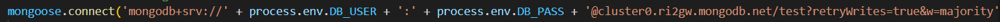
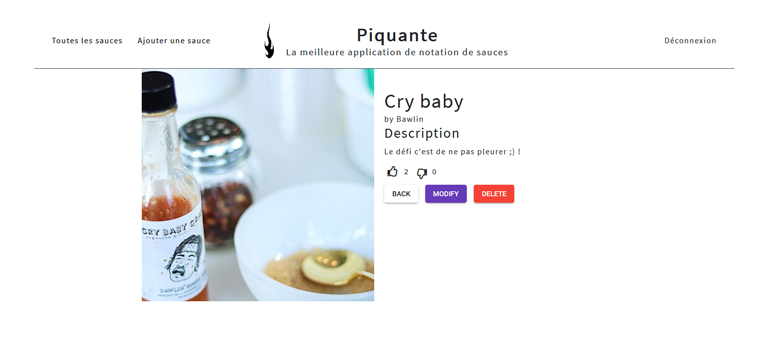

# p6-so-pekocko
L'API So Pekocko permet de partager et liker ses sauces piquantes préférées.

Vous pouvez ajouter une photo, son nom, une description et noter son piquant et elle sera enregistrée sur l'API. D'autres utilisateurs pourront la voir et liker ou disliker la sauce. Et vous pourrez aussi voir les sauces les plus appréciées et donner votre avis. 

## Prérequis
1. Vous devez cloner le dépôt https://github.com/OpenClassrooms-Student-Center/dwj-projet6 et suivre les instructions de ce dépôt.

2. Puis sur notre dépôt, dans le terminal entrez `npm init` puis `npm install`.

3. Vous devez avoir ou créer un compte sur MongoDB. Connectez vous à votre cluster et choisissez "connect your application", vous obtenez une ligne de code que vous pourrez ajouter dans le fichier app.js.

(Vous pouvez y écrire directement votre identifiant et mot de passe ou vous avez l'option de créer un fichier .env à la racine de notre dossier contenant les lignes DB_USER = votre-identifiant et DB_PASS = votre-mdp, dans ce cas là vous n'avez pas besoin de remplacer `process.env.DB_USER + ':' + process.env.DB_PASS`)

4. Enfin, dans le terminal entrez `npm start` ou `nodemon server`.

5. Vous pouvez maintenant tester l'application sur http://localhost:4200/ !

## Fonctionnement
La page d'accueil affiche toutes les sauces déjà ajoutées. Vous pouvez ajouter votre sauce. Et liker et disliker les sauces ajoutées par d'autres fans de sauces piquantes.

## Sécurité
So Pekocko utilise le top 10 de l'OWASP pour que l'application soit sécurisée : 
- une authentification est demandée pour accéder aux routes
- l'utilisateur doit rentrer un mot de passe fort
- le mot de passe est "salé"
- une limite de connexions et inscriptions permet de lutter contre les attaques par force brute
- un token aléatoire de 24 h est généré après une connexion
- les entrées des utilisateurs sont validées grâce à mongoose
- les types de fichiers que les utilisateurs peuvent envoyer sont restreints
- les messages d'erreur ne donnent pas d'information interne
- les dépendances utilisées sont vérifiées et mises à jour

